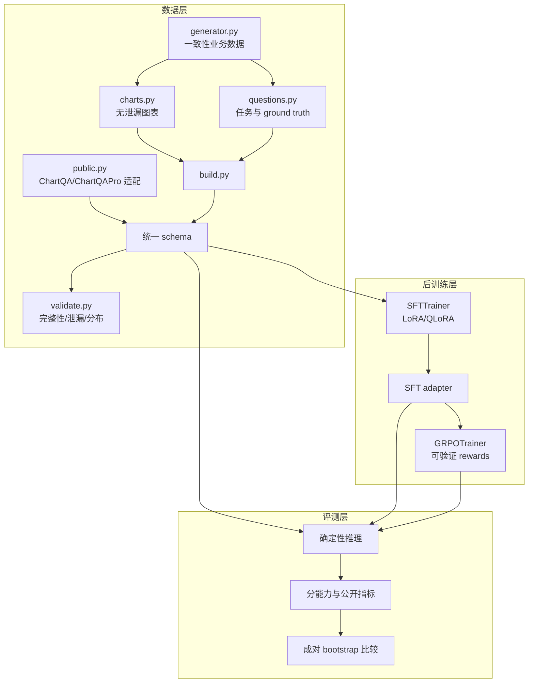

# EconoChart 系统架构

## 1. 目标与边界

EconoChart 是 Qwen3-VL-4B-Instruct 的领域后训练项目，不训练基础模型，也不把下载权重当作项目贡献。输入是一张经营图表和一个分析问题；输出必须给出可从图中核验的结论、数据依据，以及在题目要求时给出风险和建议。

项目不把以下能力放入当前范围：实时数据接入、RAG、Agent 工具调用、自动执行经营决策、无依据的因果推断。这样可以把有限算力集中到数据、视觉理解、数值推理、对齐和评测这几个可证明的核心问题。

## 2. 模块关系



所有入口都读取 YAML，路径由仓库相对路径、CLI 或环境变量解析。AutoDL 绝对路径不会写进 Python 源码。

## 3. 统一数据契约

每条记录至少包含：

```text
id, dataset, split, entity_id, chart_id, image,
industry, view_type, task_type, difficulty,
question, answer, ground_truth, metadata
```

`ground_truth` 是 JSON 字符串，包含数值目标及指标词、容差、底层数值支持集、趋势目标、证据关键词、风险标签、必需章节、长度范围和 `grpo_eligible`。同一份记录可被 SFT、离线 reward、统一评测使用，避免为训练器复制出相互漂移的标注。

划分粒度为 `entity_id`。同一企业的 financial/operations/growth/composition/dashboard 视图以及全部问法只能出现在一个 split 中。

## 4. SFT 设计

SFT 使用 TRL 的多模态 conversational prompt-completion 格式：

- `images`：单图序列；
- `prompt`：system + user；
- `completion`：assistant reference；
- `completion_only_loss=true`：不对提示词计算监督损失；
- `max_length=null`：在未证明安全前不截断 image token；
- `packing=false`、`padding_free=false`：避免对 VLM 使用未经验证的文本优化路径。

4090 主实验以 QLoRA 更新语言模型 attention/MLP projection。默认冻结视觉塔和多模态投影，原因是：

1. 图表视觉编码是基座已有能力，首要缺口是领域输出结构与推理映射；
2. 降低显存与灾难性遗忘风险；
3. 让收益更容易归因。

这不是断言“视觉模块永远不该训练”。若错误分析显示 OCR/刻度读取是主要瓶颈，再以单独实验解冻 projector 或视觉模块。

## 5. GRPO 设计

GRPO 必须从通过评测的 SFT adapter 启动。训练集只保留 `grpo_eligible=true` 的客观任务。六个 reward 顺序固定为：

1. numeric：目标数字需出现在对应指标的局部上下文，并联合目标召回率与底层真值数字精确率；
2. trend：指标对应的趋势词且排除相反趋势；
3. format：必需章节覆盖、顺序和重复惩罚；
4. evidence：关键指标证据覆盖；
5. risk：风险标签的受控同义表达；
6. length：过短和过长的软惩罚。

默认权重为 `0.35/0.20/0.15/0.15/0.10/0.05`。数值和趋势占主要权重；格式与长度不能主导，否则模型可能通过模板和冗长文本获得高 reward。

训练采用 `dr_grpo`，以全局完成长度常数归一化，避免原始按序列长度归一化带来的长度偏置；`scale_rewards=none` 避免组内标准差缩放引入题目难度偏置。它们仍是待消融的选择，而不是不可挑战的结论。

4090 smoke 用 2 个 generations、beta=0，先关闭 KL/reference-policy 计算路径；正式配置用 4 个 generations，并在更高显存环境尝试 beta=0.001。TRL 要求：

```text
world_size × per_device_batch × gradient_accumulation
必须整除 num_generations
```

preflight 在启动前检查该约束。

## 6. 评测设计

同一测试记录分别由 base、SFT adapter 和 GRPO adapter 以 greedy decoding 生成。内部指标包括 numeric、numeric recall/precision、trend、format、evidence、risk、length 和加权 overall；外部指标包括 ChartQA relaxed accuracy 与 ChartQAPro 官方兼容分数。

报告同时按 dataset、task、view、industry、difficulty 和 scenario 切片，并记录 latency、completion tokens 和吞吐。`econochart-compare` 强制 reference 对齐，并对每个共同指标做成对 bootstrap，输出 95% 置信区间与提升为正的概率。

## 7. 运行产物与血缘

每个训练或评测输出目录包含：

- `resolved_config.yaml`：继承展开后的最终配置；
- `run_manifest.json`：时间、Git commit/dirty 状态、包版本、模型/adapter、数据摘要和可训练参数；
- Trainer metrics/state/checkpoint 或 predictions/metrics；
- TensorBoard 日志（正式训练）。

原始运行目录默认被 Git 忽略。人工审核后的聚合指标、图表、实验结论和失败复盘才进入 `experiments/`。
